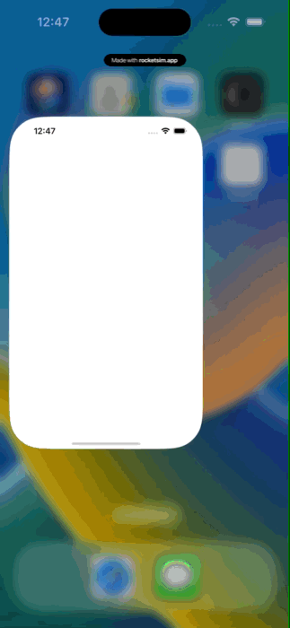
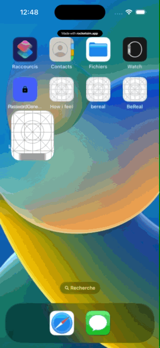
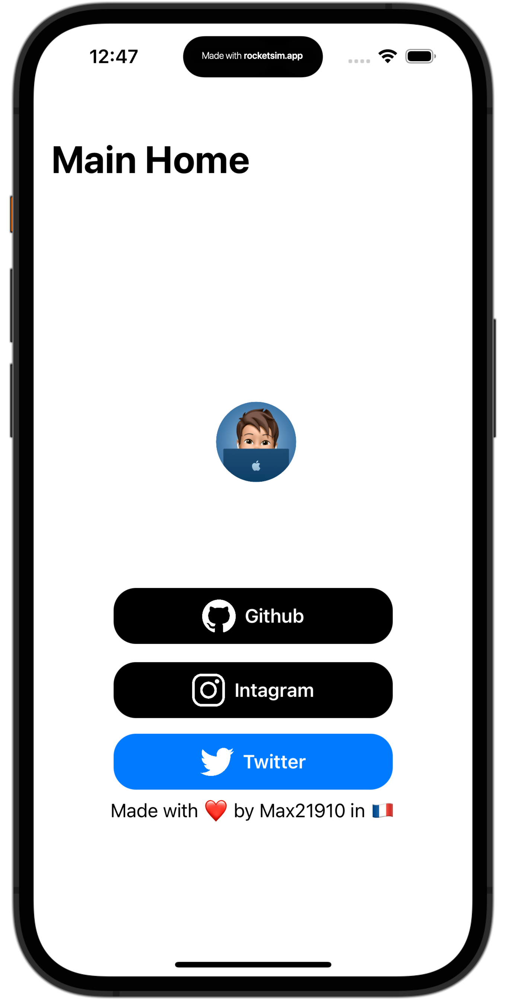
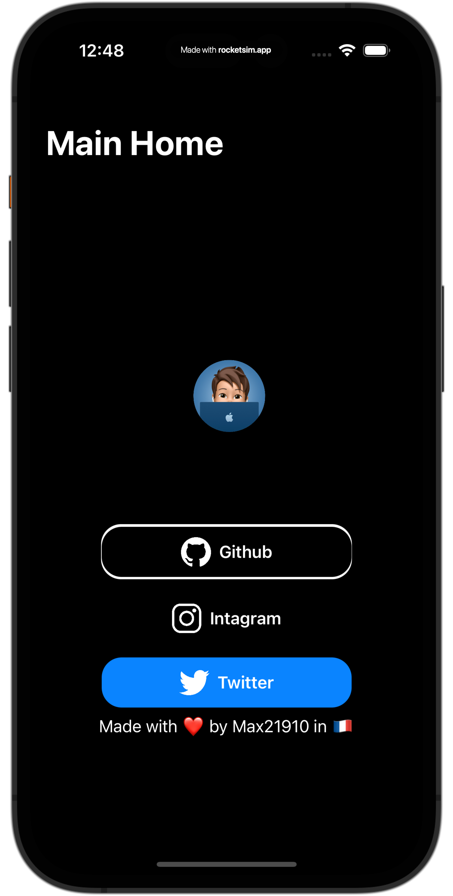

# LaunchScreen-SwiftUI

## Support :
📱 works from iOS 14 (older iOS not tested may work ) to iOS 16 (only beta tested)
## Who made this :
Made with ❤️ by Max21910 in 🇫🇷
## Description
A simple exemple of a launching screen made of 100% using SwiftUI

## Free to use ?
yes this project is open source 

## Image :

## Support White mode: 

## and dark mode :

